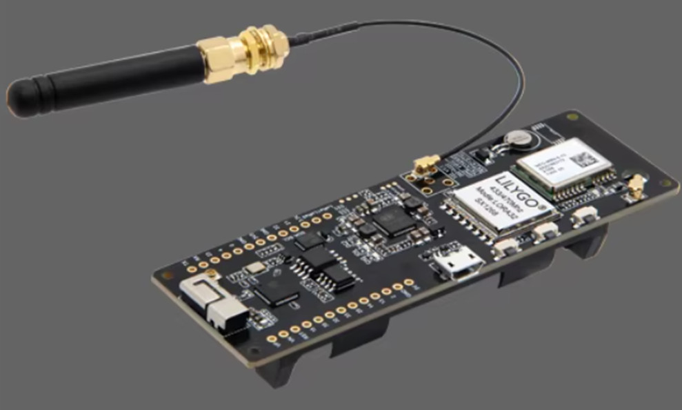
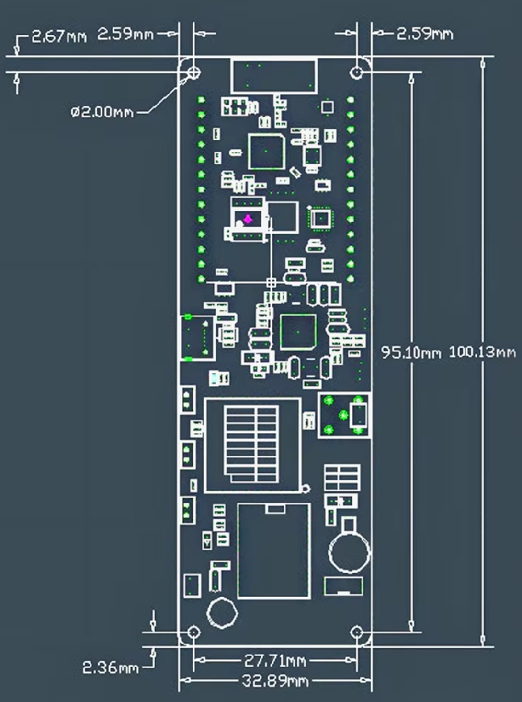
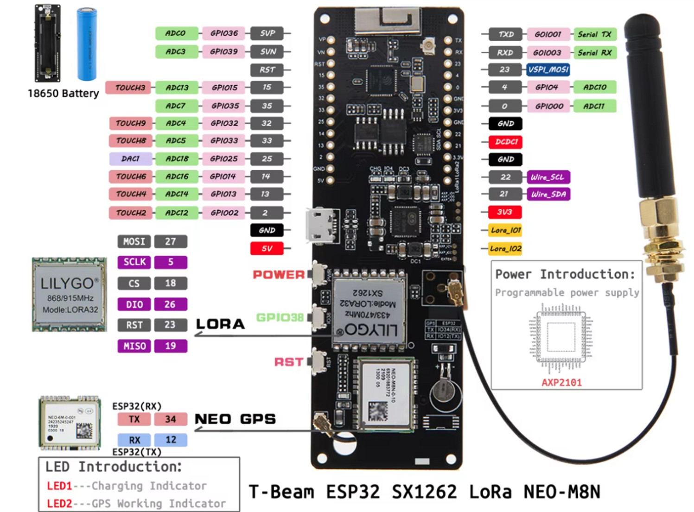

# T-Beam LoRa “Hello” Link (Sender + Receiver) — RadioLib (SX1262, 868 MHz)

A minimal two-device project using **two LILYGO T-Beam V1.2 (ESP32 + SX1262)** boards to communicate over **LoRa** in the **EU 868 MHz** band.

The program is  a "ping - pong" program between two ESP32 (T-BEAM) with LORA communication. Both T-BEAM transmit regularly their GPS position to each other. 


---

## What is LoRa (in plain words)?

**LoRa** is a long-range, low-power radio technology.  
Think of it like “walkie-talkies for tiny data”:

- ✅ Works over long distances (often hundreds of meters to kilometers depending on environment)
- ✅ Uses very little power
- ✅ Sends small messages (not suitable for high-speed data like Wi‑Fi)

In this project, LoRa is used to send a simple text message from one board to another.

---

## Software Overview

This repository contains the program "main" using the **RadioLib** library to control the **SX1262 LoRa radio** on the T-Beam.
IN this branch GPS_bearing, the distance and bearing betwene "self" T-BEAM and "companion T-BEAM" is calculated.
---

## Program Logic (How it works)

### 1) (`main.cpp`)
This sketch makes two ESP32 T‑Beam boards “take turns” talking over LoRa. One board starts by sending a first message (because #define INITIATING_NODE is enabled). After that, the devices alternate like a ping‑pong game:

Step A (Transmit): send a LoRa packet
Step B (Receive): wait for the other device’s packet, read it, then send your own GPS position back
Repeat forever.
The important idea is that LoRa sending/receiving is handled asynchronously: when you call radio.startTransmit(...) or radio.startReceive(), the radio works in the background. When it finishes (either a packet was sent or a packet was received), the radio triggers an interrupt on DIO1, and RadioLib calls your callback setFlag(). That callback only does one thing:

operationDone = true; → “Hey main loop, the radio finished something!”
#### if (operationDone) { ... } 
operationDone is like a doorbell. Most of the time it is false, and the loop() does basically nothing (it does not constantly poll the radio or block waiting).

Only when the radio signals “I’m done” (send finished or receive finished), operationDone becomes true, and then this block runs:

Enter the block only once per radio event
The first thing it does is reset the doorbell:

operationDone = false;
This prevents the code from running repeatedly for the same event.

Decide what just finished
The code then checks transmitFlag to know whether the last operation was a transmit or a receive.

So if(operationDone) means:
 “Only react when the radio has completed an action.”

#### if (transmitFlag) { ... } else { ... } 
transmitFlag is like a mode marker that tells the program what it was doing last:

transmitFlag == true → “We just transmitted something, now we should switch to listening.”
transmitFlag == false → “We just received something (or were listening), now we should process it and transmit our reply.”
##### Case 1: if (transmitFlag) (transmit just finished)
This branch runs right after a send completes:

It checks whether the send succeeded (transmissionState).
Then it immediately switches the radio into receive mode:

radio.startReceive();
transmitFlag = false;
So after sending, the device becomes a listener, waiting for the other node’s response.

##### Case 2: else (receive just finished)
This branch runs when a packet has been received:

It reads the received message (radio.readData(str)) and prints it.
Then it reads GPS data for ~1 second, and if a fresh location is available it formats:
"lat,lon\r\n"
otherwise "No GPS\r\n"
Finally it sends that message via LoRa:

```csharp
transmissionState = radio.startTransmit(msg);
transmitFlag = true;


So after receiving, the device prepares its “pong” (GPS position) and transmits it back.
---

##### Calculation of the angle and distance

For the distance calculation, the Haversine is used [Wikipedia about Haversine](https://en.wikipedia.org/wiki/Haversine_formula)

to find the bearing (direction angle) from one GPS point to another, the function treats Earth like a sphere and uses trigonometry. First, it converts both locations’ latitude and longitude from degrees to radians (because math functions expect radians). Then it looks at the difference in longitude between the two points and computes two values that represent how far “east/west” and “north/south” the second point is relative to the first on the globe. Using atan2(y, x), it turns those into an angle. Finally, it converts the angle back to degrees and normalizes it to 0–360°, where 0° is north, 90° east.

##### Terminal list during operation:

Listening for GPS...
SX126x Sender starting...
✅ Radio init OK
[SX1262] Starting to listen ... success!
Received raw: start transmitting
⚠️ Received message is not a valid 'lat,lon' pair (ignored).
Sending: 60.624949,24.828283

....

transmission finished!
Received raw: 60.624436,24.828638

✅ Parsed companion GPS -> Latitude = 60.624436 Longitude = 24.828638
📏 Distance to companion: 53.9 m
🧭 Bearing to companion: 160.7 deg (0=N, 90=E)
Sending: 60.624871,24.828298
...

transmission finished!
Received raw: 60.624539,24.828793

✅ Parsed companion GPS -> Latitude = 60.624539 Longitude = 24.828793
📏 Distance to companion: 34.5 m
🧭 Bearing to companion: 143.9 deg (0=N, 90=E)
Sending: 60.624836,24.828445


## Features

- ✅ Simple “ping pong” LoRa link 
- ✅ Uses **EU 868 MHz** frequency
- ✅ Serial logging for easy debugging
- ✅ Built with **PlatformIO** + Arduino framework
- ✅ Uses **RadioLib** (SX1262 support)

---

## Hardware / Components Used

### Boards
- **2× LILYGO T-Beam V1.2**
  - MCU: **ESP32**
  - LoRa radio: **SX1262**
  - GPS: **NEO-M8N**
  - PMU: **AXP2101**
  - USB-UART: **CH9102**
  - Flash: 4MB, PSRAM: 8MB
  - Marking: *LILYGO 868/915 MHz Model: LORA32 SX1262*

### Region / Frequency
- **Europe (EU): 868 MHz** is used in the code:
  - `static const float LORA_FREQ = 868.0;`

> ⚠️ Always follow your local radio regulations (frequency, transmit power, duty cycle).

## Dependencies / Libraries Used
 - Arduino framework (ESP32)
 - a trimmed version of RadioLib by Jan Gromeš which is "inside" this project. For me, the full library takes about 8 min to compile, with the trimmed Radiolib version, it's about 2 min. But this is only applicable for this very specific T-Beam version, which was available to me. If you want to take it out, please remove RadioLibTrim from the /lib folder.

	Used to control the SX1262 LoRa radio.
	In PlatformIO, you typically add:

	lib_deps =
	  jgromes/RadioLib
	Build & Flash (PlatformIO)

## Prerequisites
- Install VS Code
- ✅ Install the PlatformIO extension
- Connect your T-Beam via USB (CH9102 driver may be required depending on your OS)
- Compile & Upload
   
- Open the sender project and run:
- Build
- Upload
- Monitor (Serial Monitor at 115200 baud)
-Repeat for the receiver project.

-Serial Monitor Settings
-Baud rate: 115200

## Usage
-	Flash Receiver firmware to one T-Beam.
-	Flash Sender firmware to the other T-Beam.
-	Power both devices (USB or battery).
-	Ensure both use the same frequency (868.0)
-	Ensure LoRa parameters match (SF/BW/CR if you set them)
-	Verify antenna is connected
-	Verify correct SX1262 pin mapping (RST/BUSY/DIO1/NSS)

## Future Improvements
-	Add configurable LoRa parameters (SF/BW/CR) via #define or Serial commands
-	Add encryption/authentication (basic integrity protection)
-	Add deep sleep for low-power battery operation
-	Add structured payloads (JSON or binary packets)
## Acknowledgements
-	RadioLib library by Jan Gromeš and contributors
-	LILYGO for the T-Beam hardware platform
## License
-	This project is licensed under the GNU License. See the LICENSE file for details.

## Images
1. 

2. 

3.




