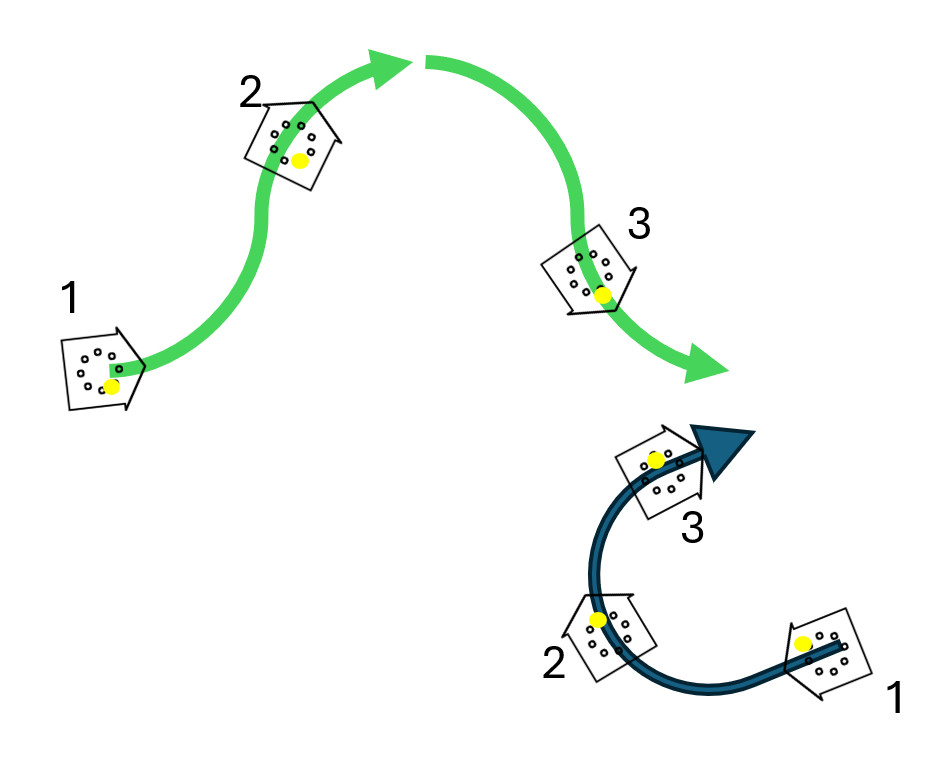
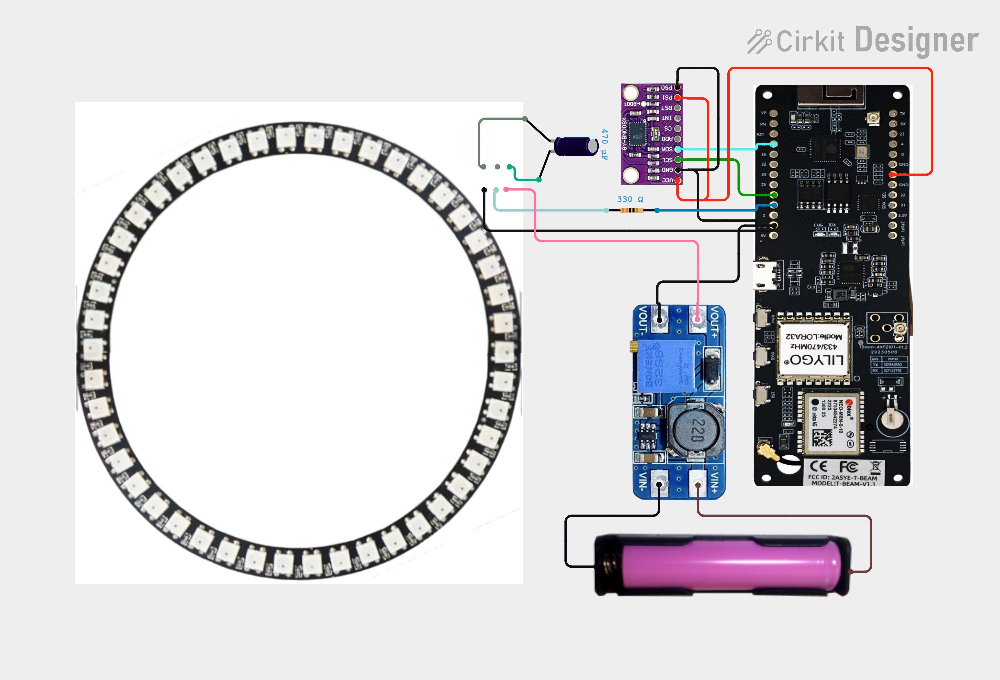
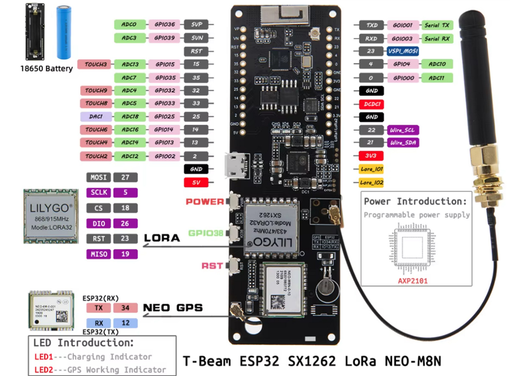
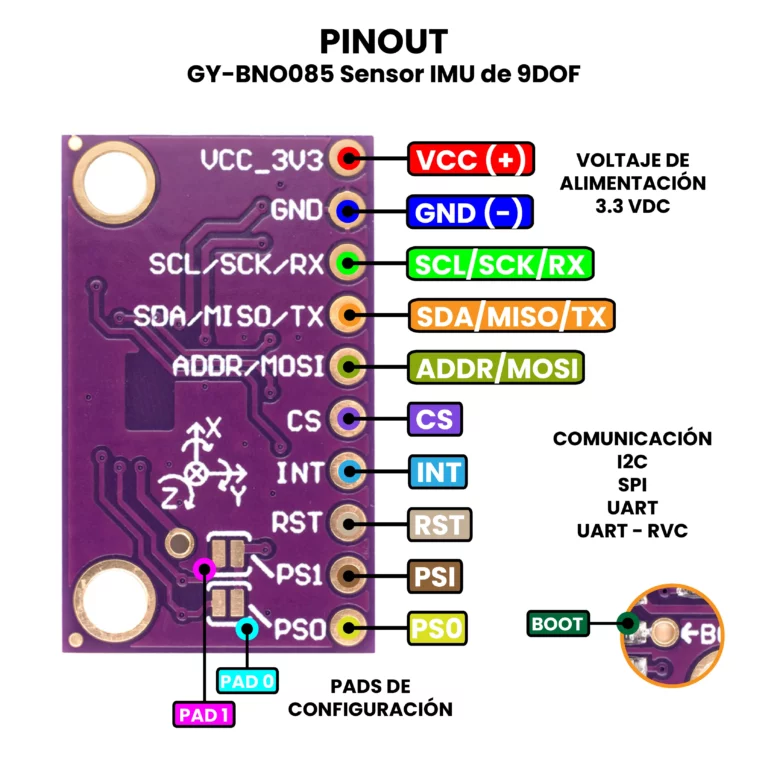
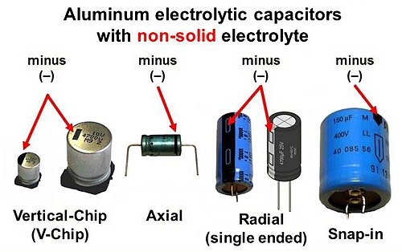
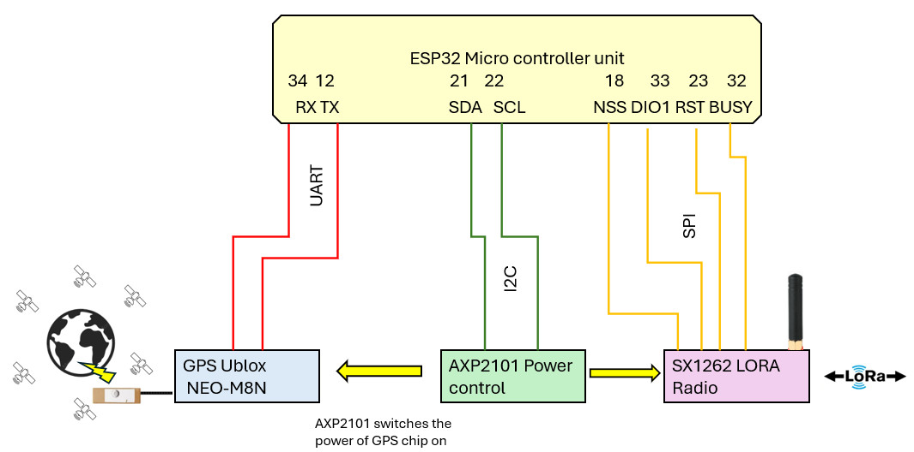
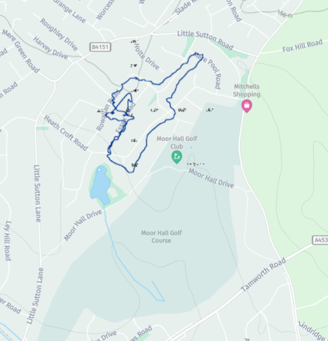

# Buddy finder compass LoRa Link (Sender + Receiver)

(Note: at the moment the program compiles, but practical test is not yet done)

## The main idea:
It’s like a “hot-and-cold” game, but instead of saying “warmer,” it simply points you in the right direction with a light.
 
Imagine two friends each carrying a small “helper gadget” when they go hiking, exploring, or looking for something. 

It is "off grid", not depending on access to phone or internet  





## What the gadget does:
- ✅ It knows which way you are facing
Like a compass, it can tell whether you’re pointing toward north, south, east, or west. 

 
- ✅ It knows where your buddy is (roughly)
Your friend’s gadget and your gadget can “talk” to each other from far away, even if you can’t see each other.

 
- ✅ It tells you which direction to walk to reach them
Your gadget compares:

 
- ✅ where you are,
where your buddy is,
and which way you’re facing,
Then it figures out: “Your buddy is that way.”

 
- ✅ It shows the direction in a super simple way
Instead of showing a map or numbers, it uses a circle of lights:

 
- ✅ If the buddy is in front of you, the LED at the “front” glows.
If they’re to your left, the LED on the left glows.
If they’re behind you, a LED at the back glows.
So you just turn until the “go that way” LED is in front, then walk forward
 
## How you’d use it in real life:

### Situation A: Two people in the woods/mountains/desert
Both people carry one gadget.
If you get separated, look at your LED compass ring ring.
Turn your body until the “correct” LED is at the front.
Walk that way.
Check again sometimes (because your buddy may also be moving).
### Situation B: Finding your dog
Put one gadget on the dog’s collar, and carry the other yourself.
If the dog runs off, look at your lights.
Turn until the “correct” light is in front.
Walk that way, checking again as you go.

## Technical explanation

A minimal two-device project using **two LILYGO T-Beam V1.2 (ESP32 + SX1262)** boards to communicate over **LoRa** in the **EU 868 MHz** band.

The program is  a "ping - pong" program between two ESP32 (T-BEAM) with LORA communication. Both T-BEAM transmit regularly their GPS position to each other. 

Each LILYGO T-Beam LORA32 868MHz module is connected  with a BNO085 sensor through a UART bus. The LILYGO T-Beam serves as the main microcontroller and communication module, while the BNO085 sensor measures the spatial orientation of the device, i.e., where the device itself is pointing in relation to the North Pole.  Because the device knows its own orientation and also the location of the second "buddy" device, it now can calculate the direction in which the other buddy device is located. This direction is then displayed using a so-called WS2812B LED Pixel Individually Addressable Ring.

---

## What is LoRa (in plain words)?

**LoRa** is a long-range, low-power radio technology.  
Think of it like “walkie-talkies for tiny data”:

- ✅ Works over long distances (often hundreds of meters to kilometers depending on environment)
- ✅ Uses very little power
- ✅ Sends small messages (not suitable for high-speed data like Wi‑Fi)

In this project, LoRa is used to send a the GPS coordinates from one board to another.

---

## Electrical circuit diagram



## Photo


# **Circuit Documentation**

## **Component List**

> 1. **LILYGO T-Beam Meshtastic LORA32 915MHz**  
   * **Description**: A microcontroller module with LoRa capabilities.  
   * **Pins**: TX, RX, 23, 4, 0, GND, 3V3, SCL/22, SDA/21, 3.3V, LoRa2, 5V, 2, 13, 14, 25, 33, 32, 35, 15, RST, VN, VP  



> 2. **BNO085**  
   * **Description**: A 9-axis sensor providing orientation and motion data.  
   * **Pins**: VCC, GND, SCL/SCK/RX, SDA/MISO/TX, ADR/MOSI, CS, INT, RST, PS1, PS0  
   
   
   
> 3. **NEOPIXEL WS2812 45 LED RING**  
   * **Description**: A ring of 45 individually addressable RGB LEDs.  
   * **Pins**: GND, D1, 5V, D0  
> 4. **Electrolytic Capacitor**  
   * **Description**: A capacitor used for power smoothing.  
   * **Properties**: Capacitance: 0.00047 Farads  
   * **Pins**: \-, \+  

   

> 5. **Resistor**  
   * **Description**: A resistor used for current limiting.  
   * **Properties**: Resistance: 330 Ohms  
   * **Pins**: pin1, pin2  

> 6. **18650 in holder**  
   * **Description**: A rechargeable lithium-ion battery in a holder.  
   * **Pins**: GND, VCC  

> 7. **MT3608**  
   * **Description**: A DC-DC boost converter for voltage regulation.  
   * **Pins**: VIN+, VIN-, VOUT+, VOUT-

## **Wiring Details**

### **LILYGO T-Beam Meshtastic LORA32 915MHz**

> * **Pin 15** is connected to **BNO085 SDA/MISO/TX**.  
> * **Pin 14** is connected to **BNO085 SCL/SCK/RX**.  
> * **Pin 3V3** is connected to **BNO085 VCC** and **PS1**.  
> * **Pin GND** is connected to **BNO085 GND**, **PS0**, **MT3608 VOUT-**, and **NEOPIXEL WS2812 45 LED RING GND**.  
> * **Pin 13** is connected to **Resistor pin2**.

### **BNO085**

> * **SDA/MISO/TX** is connected to **LILYGO T-Beam Meshtastic LORA32 915MHz Pin 15**.  
> * **SCL/SCK/RX** is connected to **LILYGO T-Beam Meshtastic LORA32 915MHz Pin 14**.  
> * **VCC** and **PS1** are connected to **LILYGO T-Beam Meshtastic LORA32 915MHz Pin 3V3**.  
> * **GND** and **PS0** are connected to **LILYGO T-Beam Meshtastic LORA32 915MHz Pin GND**, **MT3608 VOUT-**, and **NEOPIXEL WS2812 45 LED RING GND**.

### **NEOPIXEL WS2812 45 LED RING**

> * **GND** is connected to **LILYGO T-Beam Meshtastic LORA32 915MHz Pin GND**, **BNO085 GND**, **PS0**, and **MT3608 VOUT-**.  
> * **D1** is connected to **Resistor pin1**.  
> * **5V** is connected to **Electrolytic Capacitor \+** and **MT3608 VOUT+**.  
> * **D0** is not connected.

### **Electrolytic Capacitor**

> * **\-** is connected to **NEOPIXEL WS2812 45 LED RING GND**.  
> * **\+** is connected to **NEOPIXEL WS2812 45 LED RING 5V**.

### **Resistor**

> * **pin1** is connected to **NEOPIXEL WS2812 45 LED RING D1**.  
> * **pin2** is connected to **LILYGO T-Beam Meshtastic LORA32 915MHz Pin 13**.

### **18650 in holder**

> * **GND** is connected to **MT3608 VIN-**.  
> * **VCC** is connected to **MT3608 VIN+**.

### **MT3608**

> * **VIN+** is connected to **18650 in holder VCC**.  
> * **VIN-** is connected to **18650 in holder GND**.  
> * **VOUT+** is connected to **NEOPIXEL WS2812 45 LED RING 5V**.  
> * **VOUT-** is connected to **LILYGO T-Beam Meshtastic LORA32 915MHz Pin GND**, **BNO085 GND**, **PS0**, and **NEOPIXEL WS2812 45 LED RING GND**.


## Software Overview

This repository contains the program "main" using the **RadioLib** library to control the **SX1262 LoRa radio** on the T-Beam.
In this branch GPS_bearing, the distance and bearing between "self" T-BEAM and "companion T-BEAM" is calculated.

## Program Logic (How it works)

###  **GPS Initialization & Configuration**

   - Powers the GPS module via the AXP2101 PMIC (power management IC) The program attempts to communicate with the AXP2101 chip (which manages the voltages). If it finds a signal, it activates the output that powers the GPS (3.3V). Otherwise, it displays a warning.



### (`main.cpp`)
This sketch makes two ESP32 T‑Beam boards “take turns” talking over LoRa. One board starts by sending a first message (because #define INITIATING_NODE is enabled). After that, the devices alternate like a ping‑pong game:

Step A (Transmit): send a LoRa packet
Step B (Receive): wait for the other device’s packet, read it, then send your own GPS position back
Repeat forever.
The important idea is that LoRa sending/receiving is handled asynchronously: when you call radio.startTransmit(...) or radio.startReceive(), the radio works in the background. When it finishes (either a packet was sent or a packet was received), the radio triggers an interrupt on DIO1, and RadioLib calls your callback setFlag(). That callback only does one thing:

operationDone = true; → “Hey main loop, the radio finished something!”
#### if (operationDone) { ... } 
operationDone is like a doorbell. Most of the time it is false, and the loop() does basically nothing (it does not constantly poll the radio or block waiting).

Only when the radio signals “I’m done” (send finished or receive finished), operationDone becomes true, and then this block runs:

Enter the block only once per radio event
The first thing it does is reset the doorbell:

operationDone = false;
This prevents the code from running repeatedly for the same event.

Decide what just finished
The code then checks transmitFlag to know whether the last operation was a transmit or a receive.

So if(operationDone) means:
 “Only react when the radio has completed an action.”

#### if (transmitFlag) { ... } else { ... } 
transmitFlag is like a mode marker that tells the program what it was doing last:

transmitFlag == true → “We just transmitted something, now we should switch to listening.”
transmitFlag == false → “We just received something (or were listening), now we should process it and transmit our reply.”
##### Case 1: if (transmitFlag) (transmit just finished)
This branch runs right after a send completes:

It checks whether the send succeeded (transmissionState).
Then it immediately switches the radio into receive mode:

radio.startReceive();
transmitFlag = false;
So after sending, the device becomes a listener, waiting for the other node’s response.

##### Case 2: else (receive just finished)
This branch runs when a packet has been received:

It reads the received message (radio.readData(str)) and prints it.
Then it reads GPS data for ~1 second, and if a fresh location is available it formats:
"lat,lon\r\n"
otherwise "No GPS\r\n"
Finally it sends that message via LoRa:

```csharp
transmissionState = radio.startTransmit(msg);
transmitFlag = true;
```

So after receiving, the device prepares its “pong” (GPS position) and transmits it back.

##### Calculation of the angle and distance

For the distance calculation, the Haversine is used [Wikipedia about Haversine](https://en.wikipedia.org/wiki/Haversine_formula)

to find the bearing (direction angle) from one GPS point to another, the function treats Earth like a sphere and uses trigonometry. First, it converts both locations’ latitude and longitude from degrees to radians (because math functions expect radians). Then it looks at the difference in longitude between the two points and computes two values that represent how far “east/west” and “north/south” the second point is relative to the first on the globe. Using atan2(y, x), it turns those into an angle. Finally, it converts the angle back to degrees and normalizes it to 0–360°, where 0° is north, 90° east.

##### Terminal list during operation:

Listening for GPS...
SX126x Sender starting...
✅ Radio init OK
[SX1262] Starting to listen ... success!
Received raw: start transmitting
⚠️ Received message is not a valid 'lat,lon' pair (ignored).
Sending: 60.624949,24.828283

....

transmission finished!
Received raw: 60.624436,24.828638

✅ Parsed companion GPS -> Latitude = 60.624436 Longitude = 24.828638
📏 Distance to companion: 53.9 m
🧭 Bearing to companion: 160.7 deg (0=N, 90=E)
Sending: 60.624871,24.828298
...

transmission finished!
Received raw: 60.624539,24.828793

✅ Parsed companion GPS -> Latitude = 60.624539 Longitude = 24.828793
📏 Distance to companion: 34.5 m
🧭 Bearing to companion: 143.9 deg (0=N, 90=E)
Sending: 60.624836,24.828445


## Features

- ✅ “ping pong” LoRa link 
- ✅ Pong calculates distance and bearing of Ping and vice-versa 
- ✅ Uses **EU 868 MHz** frequency
- ✅ Serial logging for easy debugging
- ✅ Built with **PlatformIO** + Arduino framework
- ✅ Uses **RadioLib** (SX1262 support)

---

## Hardware / Components Used

### Boards
- **2× LILYGO T-Beam V1.2**
  - MCU: **ESP32**
  - LoRa radio: **SX1262**
  - GPS: **NEO-M8N**
  - PMU: **AXP2101**
  - USB-UART: **CH9102**
  - Flash: 4MB, PSRAM: 8MB
  - Marking: *LILYGO 868 MHz Model: LORA32 SX1262*

### Region / Frequency
- **Europe (EU): 868 MHz** is used in the code:
  - `static const float LORA_FREQ = 868.0;`

> ⚠️ Always follow your local radio regulations (frequency, transmit power, duty cycle).

## Dependencies / Libraries Used
 - Arduino framework (ESP32)
 - a trimmed version of RadioLib by Jan Gromeš which is "inside" this project in a shortened form. For me, the full library takes about 8 min to compile, with this 'trimmed' Radiolib version, it's reduced to about 2 min. But this is only applicable for this very specific T-Beam version, which was available to me. If you want to take it out, please remove RadioLibTrim from the /lib folder.

	Used to control the SX1262 LoRa radio.
	In PlatformIO, you typically add:

	lib_deps =
	  jgromes/RadioLib
	Build & Flash (PlatformIO)
  BNO085- related library
  Adafruit BNO08x

## Prerequisites
- Install VS Code
- ✅ Install the PlatformIO extension
- Connect your T-Beam via USB (CH9102 driver may be required depending on your OS)
- Compile & Upload
   
- Open the sender project and run:
- Build (#define INITIATING_NODE is not commented out)
- Upload
- Monitor (Serial Monitor at 115200 baud)
-Repeat for the receiver project, but comment out //#define INITIATING_NODE

-Serial Monitor Settings
-Baud rate: 115200

## Usage
-	Flash Receiver firmware to one T-Beam. (#define INITIATING_NODE line is active e.g. not commented out)
-	Flash Sender firmware to the other T-Beam. (//#define INITIATING_NODE line is commented out like this)
-	Power both devices (USB or battery).
-	Ensure both use the same frequency (868.0)
-	Ensure LoRa parameters match (SF/BW/CR if you set them)
-	Verify antenna is connected
-	Verify correct SX1262 pin mapping (RST/BUSY/DIO1/NSS)

## Future Improvements
-	Add a third Lora device, and develop triangulation or GPS calibration
- Testing out different LORA radio Parameters, like spreading etc
- adding  pygame based python scripts, that can simultaneously plot the route of the other beacon

## Graphical trace
One T-beam is left at home connected to the computer, and the Serial outprint is running. The other T-beam is taken along for a walk. Then the distance and angle log is imported to Excel. with the formular r*sin(alpha) and r*cos(alpha) in Excel form looking like  =A46xSIN(B46xPI()/180) and  =A46xCOS(B46xPI()/180) , one can then generate a scatter chart.



A random background map was used just for illustration purpose.

## Acknowledgements
-	RadioLib library by Jan Gromeš and contributors
-	LILYGO for the T-Beam hardware platform
- Adafruit BNO08x library
- Wolles Elektronikkiste
[Wolles Elektronikkiste](https://wolles-elektronikkiste.de/en/bno08x-9-dof-imus)


## License
-	This project is licensed under the GNU License. See the LICENSE file for details.

## Images
1. 

2. 

3.


